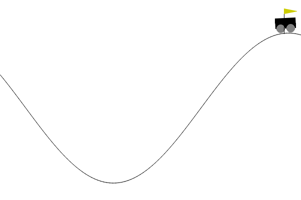

# BIAI Initial Task Report

#### Hyunseok Cho
#### Jakub Zając

## 1. Selection of Topic

For the initial task, our group selected the following topic:

**Solving the MountainCar-v0 environment using a Genetic Algorithm**

The purpose of this topic is to become familiar with the basic structure and operation of Genetic Algorithms. We selected the `MountainCar-v0` environment from Gymnasium because it is a relatively simple control problem, but it still requires the agent to learn a strategy instead of performing only one direct action.

In this environment, a small car is placed in a valley between two hills. The goal is to drive the car up the right hill and reach the flag. The car does not have enough power to reach the goal directly, so it must move left and right to build momentum.

The environment provides two observation values:

- position of the car
- velocity of the car

The agent can choose one of three actions:

- `0` — accelerate to the left
- `1` — do nothing
- `2` — accelerate to the right

Each action is executed for one time step. In `MountainCar-v0`, the environment
gives a reward of `-1` for every time step until the episode ends. Therefore,
reaching the goal in fewer steps gives a better total reward. If the agent fails
to reach the goal within the maximum number of steps, many policies receive a
similar reward near `-200`.

Example:

| Case | Result | Total reward meaning |
|---|---|---|
| Successful policy | reaches the goal in 112 steps | `-112`, because the agent used 112 actions |
| Failed policy | does not reach the goal within 200 steps | `-200`, because the episode reaches the maximum step limit |

The goal of the agent is to reach the target position as quickly as possible.

---

## 2. Preparation of a Work Plan

The work plan for the initial task is divided into several steps.

| Step | Task | Description |
|---|---|---|
| 1 | Select the environment | Choose a Gymnasium environment suitable for testing a Genetic Algorithm. |
| 2 | Understand the environment | Analyze the observation space, action space, reward system, and goal of `MountainCar-v0`. |
| 3 | Define the policy representation | Represent one candidate solution as a chromosome. In our case, one chromosome represents a policy table. |
| 4 | Create the initial population | Generate a group of random policies. |
| 5 | Evaluate individuals | Run each policy in the environment and calculate its fitness score. |
| 6 | Select parents | Choose better-performing individuals for reproduction. |
| 7 | Apply crossover | Combine parts of two parent chromosomes to create new individuals. |
| 8 | Apply mutation | Randomly change some actions in the chromosome to maintain diversity. |
| 9 | Repeat for several generations | Continue the evolutionary process to improve the population. |
| 10 | Test the best solution | Run the best evolved policy and check whether it reaches the goal. |

The planned implementation was completed in Python using Gymnasium. The program trains a population of policies over multiple generations and saves the best individual. The best policy was also tested visually using rendering, and it was able to reach the goal in the environment.

The implementation produces the following output files:

- `DATA/results.csv` — numerical results from training
- `DATA/fitness_plot.png` — graph of best and average fitness over generations
- `DATA/best_individual.npy` — saved best evolved policy

Additional comparison outputs were added after the first feedback:

- `DATA/generation_comparison.csv`: comparison of each generation champion
- `DATA/randomization_effects.csv`: effect of random seeds on reward and bonuses
- generation comparison plots for reward, max position, steps, and success rate
- `DATA/randomization_effect_plot.png`: randomization effect plot

---

## 3. Basic Explanation of the Chosen Algorithm

The chosen algorithm is a **Genetic Algorithm**.

A Genetic Algorithm is an optimization method inspired by natural evolution. It works with a population of candidate solutions. Each candidate solution is evaluated using a fitness function. Better solutions have a higher chance of being selected as parents and passing their information to the next generation.

The main components of a Genetic Algorithm are:

### Population

The population is a group of candidate solutions.  
In this project, each individual in the population represents one policy for controlling the Mountain Car.

### Chromosome

A chromosome is the encoded form of one solution.  
In our implementation, the chromosome is a table of actions. The continuous observation values of the environment are divided into discrete bins, and each bin stores one action.

For example, if the position and velocity are divided into bins, each combination of position and velocity corresponds to one action:

```text
0 = accelerate left
1 = do nothing
2 = accelerate right
```

Therefore, one chromosome represents a complete decision-making strategy for the agent.

### Fitness Function

The fitness function measures how good each individual is.

In the MountainCar-v0 environment, the agent receives -1 reward at each time step. This means that reaching the goal faster gives a better result. However, many random policies fail and receive very similar rewards.

Because of this, the fitness function also includes a stronger bonus based on
how far the car moves toward the goal. This helps the Genetic Algorithm
distinguish between policies that completely fail and policies that move closer
to the goal.

The fitness function is based on:

```total reward + progress bonus + goal bonus```

The progress bonus is calculated from the best position reached during the
episode. It measures how much of the distance from the start position to the goal
was covered. This gives more importance to moving in the correct direction, even
before the policy can reach the goal consistently.

Example fitness cases:

| Case | Total reward | Goal progress | Progress bonus | Goal bonus | Final fitness |
|---|---:|---:|---:|---:|---:|
| Failed, small movement toward goal | `-200` | `0.20` | `100` | `0` | `-100` |
| Failed, strong movement toward goal | `-200` | `0.70` | `350` | `0` | `150` |
| Successful final policy | `-112` | `1.00` | `500` | `200` | `588` |

This shows why the new fitness is useful. Two failed policies can have the same
environment reward of `-200`, but the policy that moved farther toward the goal
receives a much better fitness score.

The implementation also checks the final best policy under several random seeds.
This is used to observe how randomization affects reward, progress bonus, goal
bonus, and final fitness.

Example from the final policy randomization check:

| Seed | Total reward | Progress bonus | Goal bonus | Fitness | Result |
|---:|---:|---:|---:|---:|---|
| `2045` | `-104` | `500` | `200` | `596` | reached goal |
| `2061` | `-123` | `500` | `200` | `577` | reached goal |

The reward changes because the number of steps changes under different random
seeds. However, the progress bonus and goal bonus remain stable in these cases,
which means the final policy still reaches the goal.

The mutation and crossover settings were also adjusted. Mutation starts higher
to support exploration in early generations and gradually decreases to preserve
good solutions in later generations. The crossover rate was slightly reduced to
balance recombination with exploration.

Example mutation schedule:

| Generation | Mutation rate | Expected changed genes in a 400-gene policy |
|---:|---:|---:|
| Early generation | about `0.05` | about `20` genes |
| Middle generation | about `0.03` | about `12` genes |
| Final generation | about `0.01` | about `4` genes |

This gives the algorithm more exploration at the beginning and more stability at
the end. The crossover rate is `0.85`, so most children are still created by
combining two parents, but the lower mutation rate near the end helps preserve
good policies.

### Selection

Selection is the process of choosing better individuals as parents.
In our implementation, tournament selection is used. A few individuals are chosen randomly, and the best one among them becomes a parent.

### Crossover

Crossover combines two parent chromosomes to create new children.
Part of the first parent and part of the second parent are joined together. This allows good features from different parents to be combined.

### Mutation

Mutation randomly changes some values in a chromosome.
This prevents the population from becoming too similar and allows the algorithm to explore new possible solutions.

### Generations

After selection, crossover, and mutation, a new population is created.
This process is repeated for many generations. Over time, the population should improve, and better policies should appear.

## 4. Current Progress

The initial task has been completed.

So far, we have:

* selected the topic,
* selected the MountainCar-v0 environment,
* prepared a work plan,
* implemented a Genetic Algorithm in Python,
* trained policies over several generations,
* generated a fitness graph,
* saved the best evolved individual,
* tested the best policy visually using rendering.

The final evolved policy was able to reach the goal in the Mountain Car environment.

This confirms that the Genetic Algorithm was able to improve the agent's behavior over generations.

## 5. Graphical Representation of the Environment

To address the feedback about developing a graphical representation of the
environment, an additional visualization program was added:

```text
IMPL/visualize_best_solution.py
```

This file does not train the Genetic Algorithm again. Instead, it loads the
already saved best policy from:

```text
DATA/best_individual.npy
```

Then it runs the policy inside the `MountainCar-v0` environment so that the
movement of the car can be observed directly.

### How to run the live visualization

The following command opens a live rendering window:

```powershell
python IMPL/visualize_best_solution.py
```

This is useful during the presentation because it shows the best evolved policy
controlling the car in the actual environment.

### How to save a screenshot

The following command saves the final rendered frame as an image:

```powershell
python IMPL/visualize_best_solution.py --mode screenshot --seed 2042 --output DATA/best_solution_screenshot.png
```

The seed controls the initial state of the environment. In this example, seed
`2042` was used. The same trained policy is used every time; only the initial
environment state changes with the seed.

### Screenshot

The screenshot below shows the saved best policy reaching the goal area on the
right hill.



For the screenshot run with seed `2042`, the policy reached the goal in `156`
steps. The total reward was `-156`, the progress bonus was `500`, and the goal
bonus was `200`. This confirms that the saved best policy can be loaded and
visually checked without retraining the Genetic Algorithm.
