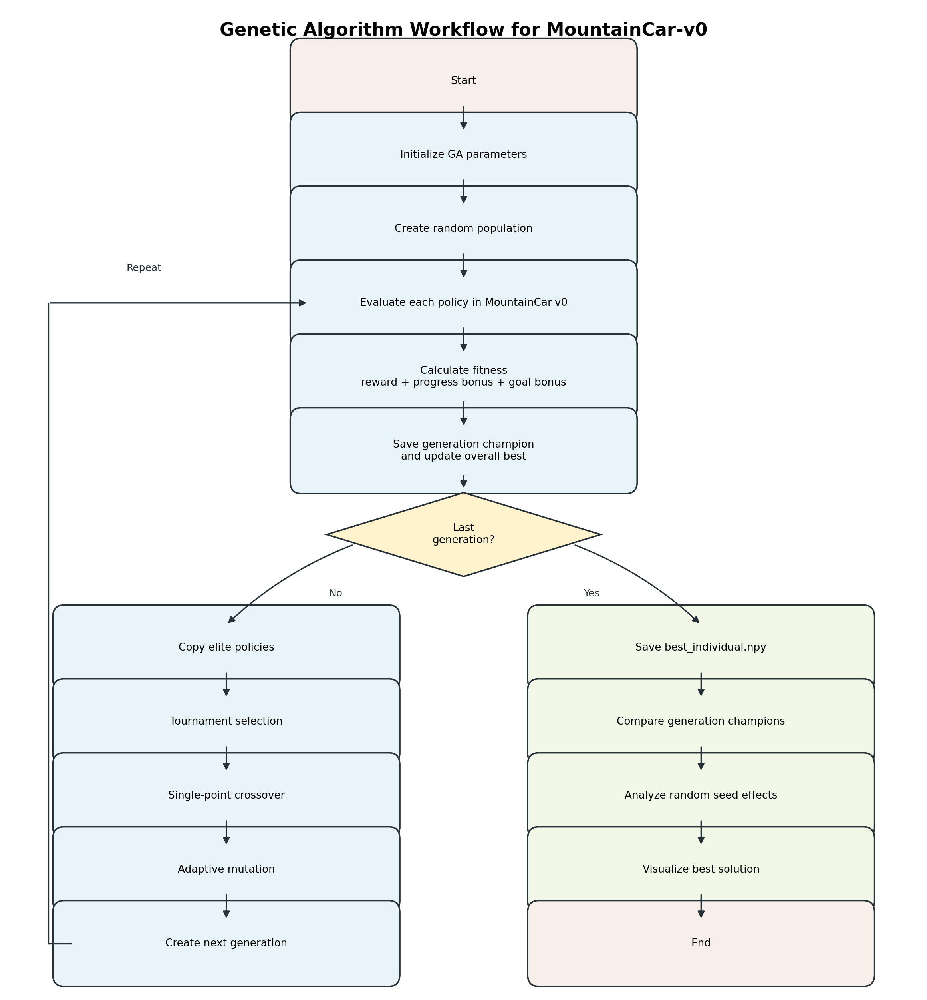

# BIAI Task 3 Report: Algorithm and Flow-chart

#### Hyunseok Cho
#### Jakub Zajac

## 1. Fitness Calculation

The Genetic Algorithm evaluates each policy by running it in the environment and
calculating a fitness score. The current fitness function is:

```text
fitness = total_reward + progress_bonus + goal_bonus
```

The purpose of this design is to reward three things:

- finishing the task in fewer steps,
- moving farther toward the goal,
- actually reaching the goal.

### 1.1 Total Reward

In `MountainCar-v0`, the environment gives a reward of `-1` for every action
step. Therefore, the total reward is the accumulated step reward:

```text
total_reward = -1 * number_of_steps
```

Examples:

| Result | Steps used | Total reward |
|---|---:|---:|
| Goal reached quickly | `112` | `-112` |
| Goal reached slowly | `180` | `-180` |
| Goal not reached before the step limit | `200` | `-200` |

This means that a less negative reward is better. For example, `-112` is better
than `-180` because the car reached the goal in fewer steps.

### 1.2 Progress Bonus

The reward alone is not enough because many failed policies receive a very
similar total reward near `-200`. To distinguish failed policies that still move
in the correct direction, the fitness function includes a progress bonus.

The progress bonus measures how much of the distance from the start position to
the goal was covered by the best position reached during the episode:

```text
goal_progress = (max_position - start_position) / (goal_position - start_position)
```

The progress value is clipped between `0.0` and `1.0`.

```text
progress_bonus = 500 * goal_progress
```

Examples:

| Case | Goal progress | Progress bonus |
|---|---:|---:|
| Car barely moves toward the goal | `0.20` | `100` |
| Car moves most of the way to the goal | `0.70` | `350` |
| Car reaches or passes the goal | `1.00` | `500` |

This component gives more importance to how far the car moves toward the goal,
even if the policy has not solved the environment yet.

### 1.3 Goal Bonus

The goal bonus is added only when the car reaches the goal.

```text
goal_bonus = 200 if reached_goal else 0
```

Examples:

| Result | Goal bonus |
|---|---:|
| Goal not reached | `0` |
| Goal reached | `200` |

### 1.4 Full Fitness Examples

| Case | Total reward | Progress bonus | Goal bonus | Final fitness |
|---|---:|---:|---:|---:|
| Failed, weak movement | `-200` | `100` | `0` | `-100` |
| Failed, strong movement | `-200` | `350` | `0` | `150` |
| Successful policy | `-112` | `500` | `200` | `588` |

These examples show why the improved fitness function is useful. Two failed
policies can both receive `-200` from the environment, but the policy that moves
closer to the goal receives a higher fitness score.

## 2. Generation Process

Each generation follows the same Genetic Algorithm process. The population is
evaluated, ranked, partially preserved through elitism, and then used to create
the next generation through selection, crossover, and mutation.

### 2.1 Evaluate the Population

Each individual represents one policy table. During evaluation, the policy is
run in the environment and receives a fitness score.

The implementation evaluates each individual over multiple episodes:

```text
EPISODES_PER_INDIVIDUAL = 3
```

The final fitness of an individual is the average fitness over these episodes.
This reduces the chance that one unusually good or bad episode dominates the
selection process.

### 2.2 Rank Individuals

After all individuals are evaluated, their fitness scores are sorted from best
to worst.

The best individual in the current generation is called the generation champion.
It is saved as:

```text
DATA/generation_champions/generation_XXX.npy
```

The algorithm also tracks the overall best individual found across all
generations. If the current generation champion has a better fitness than the
previous overall best, the overall best is updated.

### 2.3 Elite Selection

The best individuals are copied directly to the next generation.

```text
ELITE_SIZE = 6
```

This means that the top 6 policies are preserved without crossover or mutation.
The purpose is to prevent the algorithm from losing strong solutions that have
already been discovered.

### 2.4 Tournament Selection

Parents are selected using tournament selection.

The process is:

```text
1. Randomly choose 5 individuals from the population.
2. Compare their fitness scores.
3. Select the best one as a parent.
```

This is repeated to select two parents. Tournament selection gives better
individuals a higher chance of reproduction, but it still keeps randomness in
the process because the tournament candidates are randomly sampled.

### 2.5 Crossover

The algorithm uses single-point crossover.

```text
CROSSOVER_RATE = 0.85
```

With probability `0.85`, one crossover point is selected in the chromosome. The
first part of one parent is combined with the second part of the other parent to
create children.

Example:

```text
parent1 = [A A A A | A A]
parent2 = [B B B B | B B]

child1  = [A A A A | B B]
child2  = [B B B B | A A]
```

If crossover is not applied, the parents are copied as children.

### 2.6 Adaptive Mutation

Mutation changes some genes in the child policy table. A gene stores an action,
so mutation means replacing an action with a random action from `0`, `1`, or `2`.

The mutation rate is adaptive:

```text
initial mutation rate = 0.05
final mutation rate   = 0.01
```

It decreases gradually over generations.

| Generation stage | Approximate mutation rate | Expected changed genes in 400-gene policy |
|---|---:|---:|
| Early | `0.05` | about `20` genes |
| Middle | `0.03` | about `12` genes |
| Final | `0.01` | about `4` genes |

This gives the algorithm more exploration at the beginning and more stability at
the end.

### 2.7 Create the Next Generation

The next generation is created by combining:

- elite individuals copied directly,
- children created by tournament selection,
- crossover,
- and adaptive mutation.

This process repeats until the new population again contains 80 individuals.

## 3. Main Algorithm

The main algorithm follows a repeated evolutionary cycle. It starts with random
policies and gradually improves them by keeping stronger solutions and producing
new candidate policies from them.

| Step | Algorithm stage | Description |
|---:|---|---|
| 1 | Initialize | Set the Genetic Algorithm settings and prepare the `MountainCar-v0` environment. |
| 2 | Create population | Generate the first population as random policy tables. |
| 3 | Evaluate policies | Run each policy in the environment and collect reward, maximum position, goal status, and number of steps. |
| 4 | Calculate fitness | Give each policy a score using `total_reward + progress_bonus + goal_bonus`. |
| 5 | Save generation champion | Find the best policy in the current generation and save it for later comparison. |
| 6 | Update overall best | If the current champion is better than all previous champions, store it as the current best solution. |
| 7 | Preserve elites | Copy the strongest policies directly into the next generation. |
| 8 | Select parents | Use tournament selection to choose parent policies for reproduction. |
| 9 | Apply crossover | Combine parts of two parent policy tables to create new child policies. |
| 10 | Apply mutation | Randomly change some actions in the child policies using the current adaptive mutation rate. |
| 11 | Create next generation | Fill the next population with elites and newly created children. |
| 12 | Repeat | Continue the process until the final generation is reached. |
| 13 | Save final best solution | Save the best policy as `DATA/best_individual.npy`. |
| 14 | Validate and visualize | Compare generation champions, analyze random seed effects, and run the saved best policy visually. |

The key idea is that every generation contains both preservation and exploration.
Elitism preserves the best policies already found, while crossover and mutation
create new policies that may perform better. Over many generations, this process
pushes the population toward policies that reach the goal more reliably and in
fewer steps.

## 4. Flow-chart

The diagram below shows the full workflow of the Genetic Algorithm.


