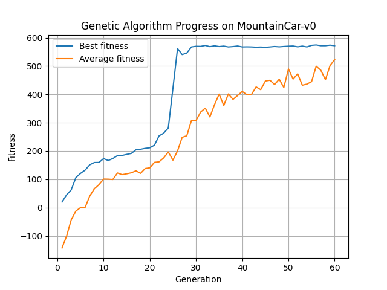
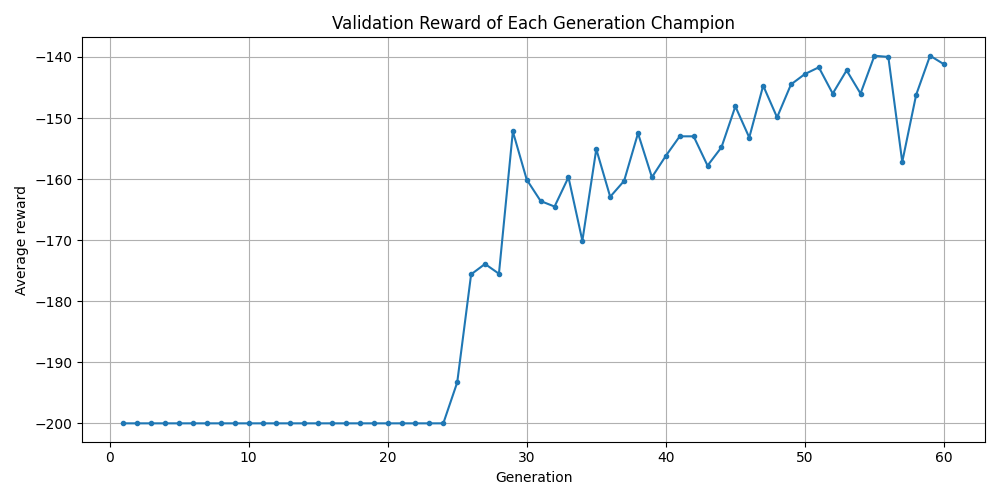
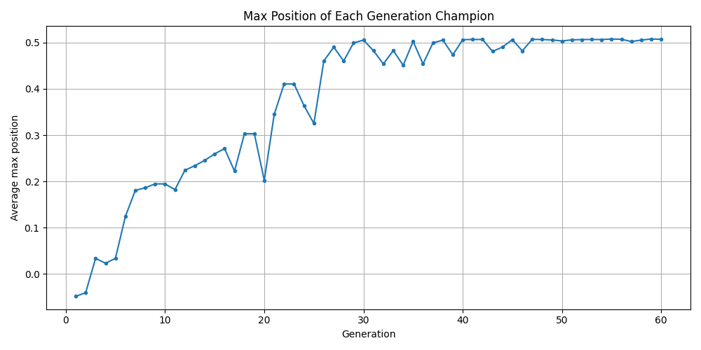
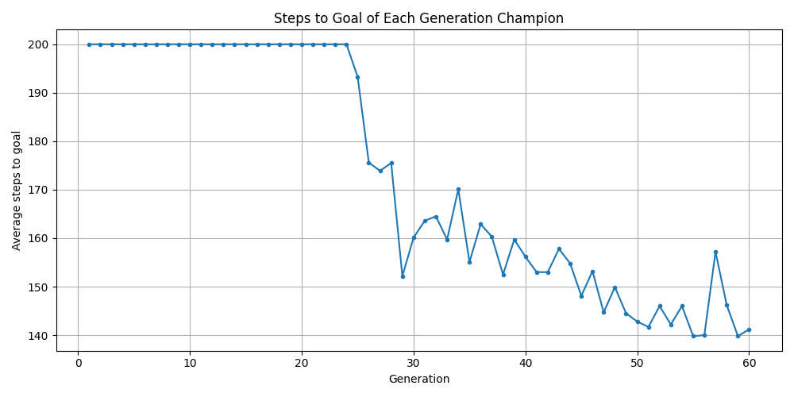
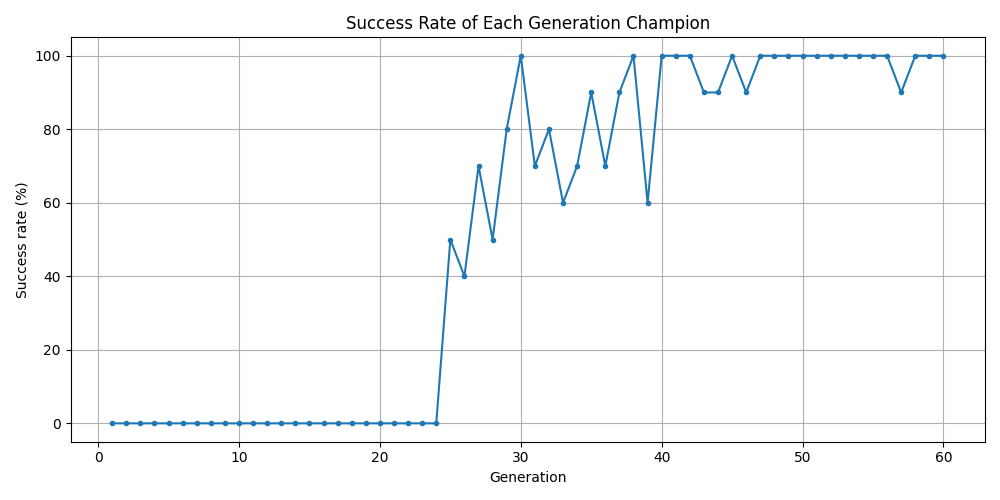
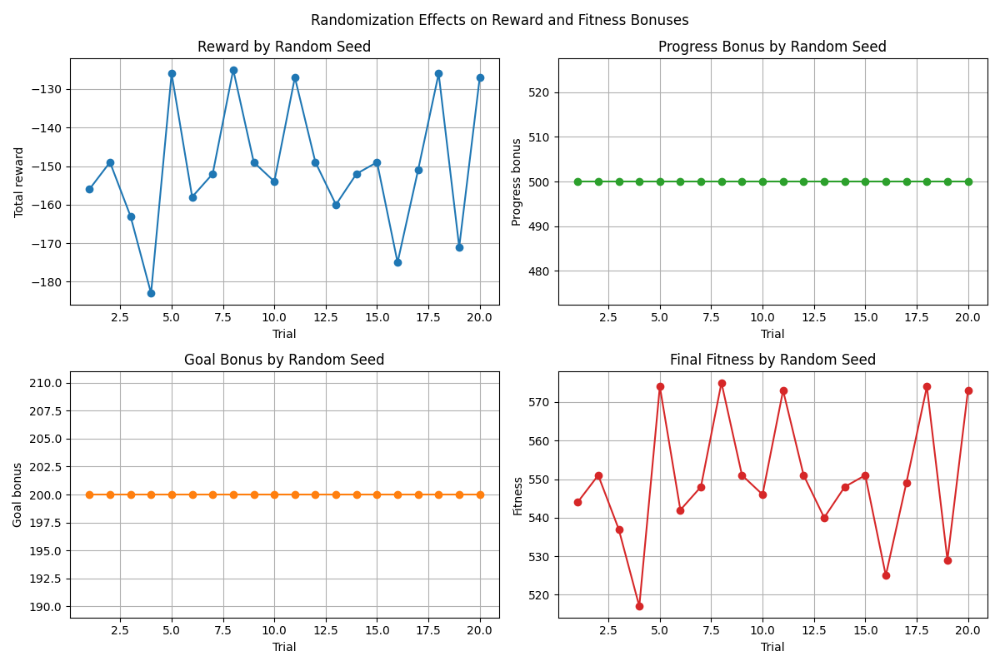

# Final Report: Genetic Algorithm for MountainCar-v0

#### Hyunseok Cho
#### Jakub Zajac
#### BIAI Project
#### June 2026

## 1. Introduction

This project applies a Genetic Algorithm to solve the `MountainCar-v0`
environment from the Gymnasium library. The environment contains a car placed in
a valley between two hills. The goal is to reach the flag on the right hill. The
car cannot reach the goal by simply accelerating right because the engine is not
strong enough. Instead, the agent must learn to move back and forth to build
momentum.

The main aim of the project is to demonstrate how a Genetic Algorithm can evolve
a population of candidate control policies. Each policy is represented as a
chromosome. The algorithm evaluates policies in the environment, selects better
ones, combines them through crossover, applies mutation, and repeats this
process over generations.

The final implementation includes:

- training of a Genetic Algorithm,
- saving the best solution from each generation,
- comparison of generation champions,
- analysis of random seed effects,
- plots for training and validation results,
- a visual program for running the saved best policy in the graphical
  MountainCar environment.

## 2. Analysis Of The Task

### 2.1 Possible Approaches

The task can be solved using several approaches. The goal is to find a control
policy that chooses actions for the car based on its current position and
velocity.

| Approach | Description | Advantages | Disadvantages |
|---|---|---|---|
| Random policy search | Generate random policies and keep the best one. | Very simple to implement. | Inefficient; does not systematically improve solutions. |
| Hand-written heuristic | Manually design rules such as moving left to build momentum and then moving right. | Easy to explain and fast to run. | Not a learning algorithm; depends heavily on human assumptions. |
| Q-learning | Learn a value table for state-action pairs. | Well suited for discrete state/action problems. | Requires discretization and careful learning-rate/exploration tuning. |
| Neural network reinforcement learning | Train a model such as DQN or policy gradient. | Can handle more complex environments. | More complex, needs more dependencies and training time. |
| Genetic Algorithm | Evolve a population of policies through selection, crossover, and mutation. | Matches the course topic, easy to visualize over generations, does not require gradients. | Requires many environment evaluations and can be sensitive to fitness design. |

The selected approach is the Genetic Algorithm because the first purpose of the
project was to understand evolutionary optimization.

### 2.2 Selected Methodology

The selected method represents one candidate solution as a discrete policy
table. The environment observation has two continuous values:

- car position,
- car velocity.

To make these values usable in a chromosome, both dimensions are discretized:

```text
position bins = 20
velocity bins = 20
number of states = 20 * 20 = 400
```

Each chromosome therefore has 400 genes. Each gene stores one action:

```text
0 = accelerate left
1 = do nothing
2 = accelerate right
```

During an episode, the current observation is converted into a discrete state
index. The algorithm then reads the action stored at that index in the policy
table.

The core Genetic Algorithm process is:

```text
1. Create a random population.
2. Evaluate every policy in MountainCar-v0.
3. Calculate a fitness score for each policy.
4. Save the best policy of the current generation.
5. Preserve elite policies.
6. Select parents using tournament selection.
7. Apply single-point crossover.
8. Apply adaptive mutation.
9. Create the next generation.
10. Repeat until the final generation.
```

The final fitness function is:

```text
fitness = total_reward + progress_bonus + goal_bonus
```

The environment gives `-1` reward at each time step:

```text
total_reward = -1 * number_of_steps
```

The progress bonus rewards movement toward the goal:

```text
goal_progress = (max_position - start_position) / (goal_position - start_position)
progress_bonus = 500 * goal_progress
```

The goal bonus rewards successful completion:

```text
goal_bonus = 200 if reached_goal else 0
```

This fitness design was chosen because the raw environment reward alone is not
informative enough for failed policies. Many weak policies receive a similar
reward near `-200`. The progress bonus helps distinguish policies that fail
completely from policies that move closer to the goal.

### 2.3 Datasets

This project does not use a traditional static dataset such as images, text, or
tabular records. The data is generated through interaction with the simulation
environment.

The available data sources are:

| Data source | Description | Used in the project |
|---|---|---|
| Environment observations | Position and velocity returned by `MountainCar-v0`. | Yes |
| Environment rewards | Reward of `-1` per step until termination or truncation. | Yes |
| Episode metrics | Start position, maximum position, final position, goal status, steps. | Yes |
| Training history | Best, average, and overall best fitness per generation. | Yes |
| Generation champion validation | Metrics for the best policy from each generation. | Yes |
| Randomization trials | Final policy tested with different reset seeds. | Yes |

The chosen data is generated directly by Gymnasium during training and testing.
The project saves processed experimental data into CSV files:

- `DATA/results.csv`,
- `DATA/generation_comparison.csv`,
- `DATA/randomization_effects.csv`.

These files are used to create the plots and support the analysis in this
report.

### 2.4 Tools, Frameworks, And Libraries

The implementation uses Python and several supporting libraries.

| Tool / library | Purpose in the project |
|---|---|
| Python | Main programming language. |
| Gymnasium | Provides the `MountainCar-v0` environment and rendering. |
| NumPy | Stores chromosomes as arrays and performs numerical operations. |
| Matplotlib | Creates training, validation, and randomization plots. |
| csv module | Saves numerical experiment results. |
| pathlib | Handles output paths such as generation champion files. |
| argparse | Provides command-line options for the visualization script. |
| pygame | Supports classic-control rendering through Gymnasium. |

The required packages are listed in `IMPL/requirements.txt`:

```text
gymnasium
numpy
matplotlib
gymnasium[classic_control]
pygame
```

The selected toolset is lightweight and appropriate for a course project. It is
also easy to run locally because it does not require GPU acceleration or a large
machine-learning framework.

## 3. Internal And External Specification Of The Software Solution

### 3.1 Internal Specification

The implementation is divided mainly into two Python scripts:

- `IMPL/mountain_car_ga.py`: training, evaluation, saving results, and plotting.
- `IMPL/visualize_best_solution.py`: graphical execution of the saved best policy.

The most important functions in `IMPL/mountain_car_ga.py` are:

| Function | Responsibility |
|---|---|
| `create_environment()` | Creates the Gymnasium environment. |
| `discretize_observation()` | Converts continuous position and velocity into discrete bin indices. |
| `get_action()` | Reads the action from the policy table for the current discretized state. |
| `run_policy_episode()` | Runs one policy in one episode and records reward, steps, and positions. |
| `calculate_goal_progress()` | Calculates how much of the distance toward the goal was covered. |
| `calculate_fitness_components()` | Calculates reward, progress bonus, goal bonus, and final fitness. |
| `create_individual()` | Creates one random 400-gene policy. |
| `create_population()` | Creates the initial population of policies. |
| `evaluate_individual()` | Runs one individual over multiple episodes and returns average fitness. |
| `evaluate_population()` | Evaluates all individuals in the current generation. |
| `tournament_selection()` | Selects a parent using tournament selection. |
| `crossover()` | Applies single-point crossover to two parents. |
| `get_mutation_rate()` | Calculates the adaptive mutation rate for the current generation. |
| `mutate()` | Randomly changes genes in a policy. |
| `create_next_generation()` | Builds the next population using elites and children. |
| `save_generation_champion()` | Saves the best policy from the current generation. |
| `compare_generation_champions()` | Validates each generation champion with fixed seeds. |
| `analyze_randomization_effects()` | Tests the final best policy under multiple random seeds. |
| `train()` | Runs the full Genetic Algorithm workflow. |

The most important functions in `IMPL/visualize_best_solution.py` are:

| Function | Responsibility |
|---|---|
| `load_policy()` | Loads `DATA/best_individual.npy`. |
| `run_policy()` | Runs the saved policy in human or screenshot render mode. |
| `save_screenshot()` | Saves the final rendered frame. |
| `print_summary()` | Prints reward, position, fitness, and goal information. |
| `parse_args()` | Reads command-line options. |
| `main()` | Executes the visualization workflow. |

### 3.2 Data Structures

The main data structures are:

| Data structure | Type | Description |
|---|---|---|
| Individual | NumPy array | A 400-gene policy table. |
| Gene | Integer | One action: `0`, `1`, or `2`. |
| Population | List of NumPy arrays | A list of 80 policies. |
| Fitness scores | List of floats | One fitness score for each individual. |
| History | List of dictionaries | Training metrics for each generation. |
| Generation champions | List of NumPy arrays | Best policy from each generation. |
| Validation summary | Dictionary | Average reward, max position, success rate, and fitness. |
| Randomization history | List of dictionaries | Results of the final policy under different seeds. |

The policy indexing method is:

```text
state_index = position_index * VELOCITY_BINS + velocity_index
```

Example:

```text
position_index = 8
velocity_index = 12
state_index = 8 * 20 + 12 = 172
```

The policy then chooses:

```text
action = individual[172]
```

### 3.3 External Specification

The project is executed from the command line.

First, create and activate a virtual environment:

```powershell
python -m venv .venv
.\.venv\Scripts\Activate.ps1
```

Install dependencies:

```powershell
pip install -r IMPL/requirements.txt
```

Run training:

```powershell
python IMPL/mountain_car_ga.py
```

Run the saved best solution in a graphical window:

```powershell
python IMPL/visualize_best_solution.py
```

Save a screenshot:

```powershell
python IMPL/visualize_best_solution.py --mode screenshot --seed 2042 --output DATA/best_solution_screenshot.png
```

The main output files are:

| File | Description |
|---|---|
| `DATA/results.csv` | Training fitness values for each generation. |
| `DATA/fitness_plot.png` | Best and average training fitness over generations. |
| `DATA/best_individual.npy` | Best policy found during the whole training run. |
| `DATA/generation_champions/generation_XXX.npy` | Best policy saved from each generation. |
| `DATA/generation_comparison.csv` | Validation metrics for each generation champion. |
| `DATA/generation_reward_plot.png` | Average reward of each generation champion. |
| `DATA/generation_max_position_plot.png` | Average maximum position reached by each champion. |
| `DATA/generation_steps_to_goal_plot.png` | Average steps to goal for each champion. |
| `DATA/generation_success_rate_plot.png` | Success rate of each generation champion. |
| `DATA/randomization_effects.csv` | Final policy metrics under different random seeds. |
| `DATA/randomization_effect_plot.png` | Reward, bonus, and fitness under different seeds. |
| `DATA/best_solution_screenshot.png` | Screenshot from the saved best policy. |

### 3.4 Main Algorithm Flow Chart

The following diagram summarizes the main Genetic Algorithm workflow.


## 4. Experiments

### 4.1 Experimental Background

The experiments were designed to answer four questions:

1. Does the Genetic Algorithm improve policy fitness over generations?
2. Which generation champions perform best under the same validation
   conditions?
3. Is the final best solution stable when the environment reset seed changes?
4. Can the saved best solution be executed visually without retraining?

The main training parameters were:

| Parameter | Value |
|---|---:|
| Environment | `MountainCar-v0` |
| Population size | `80` |
| Generations | `60` |
| Elite size | `6` |
| Tournament size | `5` |
| Crossover rate | `0.85` |
| Initial mutation rate | `0.05` |
| Final mutation rate | `0.01` |
| Episodes per individual | `3` |
| Maximum episode steps | `200` |
| Validation episodes per champion | `10` |
| Randomization trials for final policy | `20` |

The mutation rate decreases linearly:

```text
mutation_rate = initial_rate + (final_rate - initial_rate)
                * generation / (generations - 1)
```

This gives more exploration in early generations and more stability in later
generations.

### 4.2 Result Presentation Method

The experiment results are presented using CSV files and plots.

| Plot | X-axis | Y-axis | Meaning |
|---|---|---|---|
| `DATA/fitness_plot.png` | Generation | Fitness | Training best and average fitness. |
| `DATA/generation_reward_plot.png` | Generation | Average reward | Reward of each generation champion under validation seeds. |
| `DATA/generation_max_position_plot.png` | Generation | Average max position | How far each champion moves toward the goal. |
| `DATA/generation_steps_to_goal_plot.png` | Generation | Average steps to goal | Number of steps needed to finish. Failed runs count as `200`. |
| `DATA/generation_success_rate_plot.png` | Generation | Success rate (%) | Percentage of validation episodes reaching the goal. |
| `DATA/randomization_effect_plot.png` | Trial | Reward / bonuses / fitness | Effect of changing reset seeds for the final best policy. |

The fitness calculations are based on:

```text
fitness = total_reward + progress_bonus + goal_bonus
```

where:

```text
total_reward = -1 * number_of_steps
progress_bonus = 500 * goal_progress
goal_bonus = 200 if reached_goal else 0
```

### 4.3 Experiment 1: Training Progress

This experiment checks whether the population improves during the 60
generations.



Key training values:

| Generation | Best fitness | Average fitness | Overall best fitness | Mutation rate |
|---:|---:|---:|---:|---:|
| 1 | `19.78` | `-142.41` | `19.78` | `0.0500` |
| 56 | `574.67` | `499.58` | `574.67` | `0.0127` |
| 60 | `572.00` | `523.18` | `574.67` | `0.0100` |

The first generation starts with mostly random policies. The best fitness is
only `19.78`, and the average fitness is negative. This means that most
policies are still weak.

By generation 56, the best training fitness reaches `574.67`. The average
fitness is also much higher, which means improvement is not limited to one
individual. The overall population has learned more useful action patterns.
Training-best and validation-best are different measurements: in this run,
generation 56 is the training-best generation, while generation 55 is the
validation-best champion because validation uses fixed seeds and a separate
evaluation process.

Generation 60 has a slightly lower best fitness than generation 56, but this is
normal in evolutionary algorithms because crossover and mutation introduce
random variation. The algorithm keeps the overall best policy separately, so the
best discovered solution is not lost.

Partial conclusion: the Genetic Algorithm clearly improves the population over
generations. The fitness function provides enough guidance for the algorithm to
move from random behavior to successful goal-reaching policies.

### 4.4 Experiment 2: Generation Champion Comparison

This experiment compares the best policy from each generation. Every generation
champion is evaluated under the same validation seeds, so the comparison is more
consistent than using random training episodes only.









Important validation results:

| Champion | Validation reward | Avg max position | Avg steps to goal | Success rate | Avg fitness |
|---:|---:|---:|---:|---:|---:|
| Generation 1 | `-200.00` | `-0.0482` | `200.00` | `0%` | `28.13` |
| Generation 55 | `-139.80` | `0.5077` | `139.80` | `100%` | `560.20` |
| Generation 60 | `-141.20` | `0.5071` | `141.20` | `100%` | `558.80` |

The first generation champion does not reach the goal in validation. Its
average reward is `-200.00`, which means the validation episodes usually reach
the step limit. Its average max position is still below the goal.

The best validation fitness appears at generation 55. This champion reaches the
goal in all 10 validation episodes and achieves an average fitness of `560.20`.
It also reaches an average maximum position above the goal threshold.

The final generation champion also reaches the goal in all 10 validation
episodes. Its validation fitness is slightly lower than generation 55 because it
uses slightly more steps on average. However, it is still a strong and stable
policy.

Partial conclusion: comparing generation champions is useful because the last
generation is not always the absolute best one. Saving each champion allows the
project to identify which generation produced the strongest validated policy.

### 4.5 Experiment 3: Randomization Effects

This experiment tests the final best policy under 20 different environment
reset seeds. The purpose is to check whether the policy only works for one
initial condition or whether it works under several randomized starts.



Summary of the randomization experiment:

| Metric | Value |
|---|---:|
| Trials | `20` |
| Successful trials | `20` |
| Success rate | `100%` |
| Average reward | `-150.10` |
| Best reward | `-125.00` |
| Worst reward | `-183.00` |
| Average fitness | `549.90` |
| Best fitness | `575.00` |
| Worst fitness | `517.00` |
| Average steps to goal | `150.10` |
| Fewest steps to goal | `125` |
| Most steps to goal | `183` |

The reward changes between trials because each seed can produce a different
starting position. A different starting position can make the car need more or
fewer steps to reach the goal.

However, the progress bonus is stable at `500` and the goal bonus is stable at
`200` in the randomization plot. This means the final policy reaches the goal in
all tested randomization trials. The fitness still changes because the total
reward depends on the number of steps.

Partial conclusion: the final best policy is robust for the tested seeds. It
does not only solve a single starting condition.

### 4.6 Experiment 4: Graphical Validation

The project includes a separate visualization program:

```text
IMPL/visualize_best_solution.py
```

This script loads:

```text
DATA/best_individual.npy
```

and runs the saved policy in the MountainCar graphical environment. It can
either open a live render window or save a screenshot.

The screenshot below was generated with seed `2042`.


For this run:

| Metric | Value |
|---|---:|
| Seed | `2042` |
| Total reward | `-156` |
| Steps to goal | `156` |
| Progress bonus | `500` |
| Goal bonus | `200` |
| Fitness | `544` |
| Reached goal | `True` |

Partial conclusion: the saved solution can be demonstrated visually without
retraining. This satisfies the requirement of using a graphical environment and
supports the final presentation.

## 5. Summary, Conclusions, And Future Work

The project successfully demonstrates a Genetic Algorithm applied to a practical
control problem in a graphical Gymnasium environment. The final policy reaches
the MountainCar goal reliably in the tested validation and randomization
conditions.

The most important conclusions are:

- A policy table can represent a complete control strategy for `MountainCar-v0`.
- The raw environment reward alone is not enough to guide early evolution well.
- Adding a progress bonus improves the fitness signal for partially successful
  policies.
- Elitism prevents the algorithm from losing strong policies.
- Tournament selection, crossover, and adaptive mutation provide a balance
  between preserving good solutions and exploring new ones.
- Saving each generation champion makes it possible to compare generations
  fairly after training.
- The final best policy works across multiple random seeds and can be shown in
  a live graphical environment.

Possible improvements and future work:

- Test more random seeds to evaluate robustness more broadly.
- Repeat the entire training process with different base seeds and compare the
  stability of the Genetic Algorithm itself.
- Tune population size, elite size, tournament size, mutation rate, and
  crossover rate more systematically.
- Compare the Genetic Algorithm with Q-learning or a neural-network-based
  reinforcement learning method.
- Add video or GIF recording for easier presentation of the final solution.
- Build a small dashboard that loads CSV files and displays all plots together.

## 6. References

1. Gymnasium Documentation. `MountainCar-v0` environment.  
   <https://gymnasium.farama.org/environments/classic_control/mountain_car/>

2. Gymnasium Documentation. General Gymnasium library documentation.  
   <https://gymnasium.farama.org/>

3. NumPy Documentation.  
   <https://numpy.org/doc/>

4. Matplotlib Documentation.  
   <https://matplotlib.org/stable/>

5. Python Documentation. CSV File Reading and Writing.  
   <https://docs.python.org/3/library/csv.html>

6. Project source code and generated results in the BIAI repository.  
   <https://github.com/Hyunseok-Cho/BIAI>

## 7. Project Files Link And Final File Organization

The project files are available in the Git repository:

<https://github.com/Hyunseok-Cho/BIAI>

The final submission package should follow the required structure:

```text
/DOC
  Report.pdf
  Presentation.pdf
  Assumptions.pdf

/IMPL
  mountain_car_ga.py
  visualize_best_solution.py
  requirements.txt
  README.md

/DATA
  best_individual.npy
  generation_champions/
  results.csv
  generation_comparison.csv
  randomization_effects.csv
  fitness_plot.png
  generation_reward_plot.png
  generation_max_position_plot.png
  generation_steps_to_goal_plot.png
  generation_success_rate_plot.png
  randomization_effect_plot.png
  best_solution_screenshot.png
  task3_algorithm_flowchart.png
```

The current repository already contains the implementation files, generated CSV
files, plots, saved policies, and report drafts. This Markdown file is prepared
as the source version of the final report and can be converted to `Report.pdf`
for submission.
